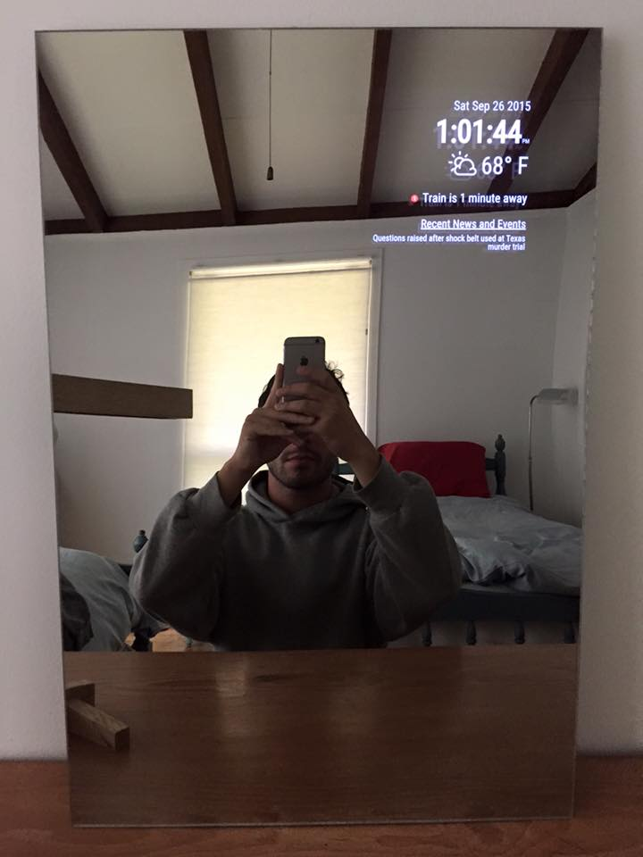

# BlackMirror

BlackMirror is a side project inspired by Hannah Mitt's [HomeMirror](https://github.com/HannahMitt/HomeMirror).

### Features
  
  - [x] Date and Time
  - [x] News and Events
  - [x] Weather (pull from forecast.io)
  - [x] Weather Icons (pull from noun project)
  - [x] Subway (pull from [Google Maps](https://developers.google.com/maps/documentation/directions/intro#TravelModes))
  - [ ] Exercise (pull from [nike+](https://developer.nike.com/content/nike-developer-cq/us/en_us/index/documentation/api-docs.html)) (Can't get an api key)
  - [ ] Stock Ticker (pull from [markit](http://dev.markitondemand.com/))

### Stack

  - Node and Express
  - Backbone
  - Sass
  - Grunt

### Tools

- [x] Mirror 24x16 1/8"
- [x] Android Device [Amazon](http://www.amazon.com/gp/offer-listing/B009X3UW2G/ref=olp_tab_refurbished?ie=UTF8&condition=refurbished&qid=1441327955&sr=8-1)
- [x] Black Backing
- [x] Velcro [Amazon](http://www.amazon.com/VELCRO-Industrial-Strength-Wide-Black/dp/B00006RSP1/ref=sr_1_2?ie=UTF8&qid=1442924711&sr=8-2&keywords=strong+velcro+strips)
- [x] Adhesive Spray [Home Depot](http://www.homedepot.com/p/3M-Super-77-16-75-fl-oz-Multi-Purpose-Spray-Adhesive-77-CC/100067550)